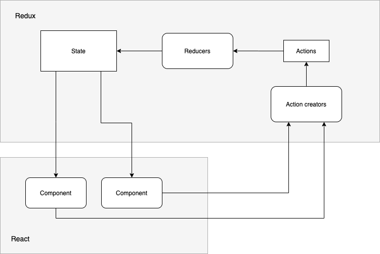

# FE FHIR API architecture

## Problem

EAS will provide us with a new set of services with data in FHIR format. This will differ from the current services and data formats.

How do we migrate to these new services without replacing them all at once?

## Dependencies

1. A full understanding of the intended flow and how resources map to VistA concepts
2. Services will be released in production as they are completed, not all at once in September. If we don't do this, we increase risk for VAOS-R up to September and for both VAOS-R and EAS in September.

## Background

The front end needs to be able keep the codebase as consistent as possible when using EAS endpoints or var-resources endpoints. Running a fork or separate branch is not acceptable.

In general, we should focus on pushing the differences down as close the api call layer as possible. Ideally, we do not have to do any switching at the React component layer to accommodate FHIR vs VAR differences. 

This likely means that we'll need to map either VAR or FHIR into a common format, and potentially create a layer that can consolidate different endpoints together to make our code sync up between the two services.

As far as data mapping, we have three options:

1. Map FHIR data to existing VAR format
2. Map VAR format to FHIR format
3. Map both to simplified FHIR format

## Technical approach

Our current UI architecture looks like this:

And drilling down, the actions layer looks like:

TODO

Our tentative approach is to add a service layer in between the action creators and API. This layer will handling the switching logic between the FHIR apis and the old VAR apis. This layer will map all data into a common, simplified FHIR-based format. The services available will be organized to be as much like the FHIR resources as possible. 

TODO

As we migrate fully over to the FHIR APIs, the service layer will shrink and become very similar to our current API layer, which is a thin wrapper around the fetch calls to the VAR apis.

TODO

## Service design doc

This will document:

1. The different functions we need in each service
2. The FHIR and VAR APIs used by each
3. The simplified data output format

This organization may change depending on our understanding of the flow.

### Organization

### Location

### HealthcareService

### Schedule

### Slot

### Appointment
