# VA.gov School Resources Page: Guidance for Content Editors  

<kbd></kbd>  

## Table of Contents  

**[Introduction](https://github.com/department-of-veterans-affairs/va.gov-team/blob/master/products/office-administration/vba/sco-migration/design/content/content-editor-guide.md#introduction)**  
**[What is a GitHub repository?](https://github.com/department-of-veterans-affairs/va.gov-team/blob/master/products/office-administration/vba/sco-migration/design/content/content-editor-guide.md#what-is-a-github-repository)**  
**[Content review by Digital Service](https://github.com/department-of-veterans-affairs/va.gov-team/blob/master/products/office-administration/vba/sco-migration/design/content/content-editor-guide.md#content-review-by-digital-service)**  
     [Content review for the main page](https://github.com/department-of-veterans-affairs/va.gov-team/blob/master/products/office-administration/vba/sco-migration/design/content/content-editor-guide.md#content-review-for-the-main-page)   
     [Content review for events and announcements](https://github.com/department-of-veterans-affairs/va.gov-team/blob/master/products/office-administration/vba/sco-migration/design/content/content-editor-guide.md#content-review-for-events-and-announcements)	  
**[Main page](https://github.com/department-of-veterans-affairs/va.gov-team/blob/master/products/office-administration/vba/sco-migration/design/content/content-editor-guide.md#main-page)**  
     [What is considered main page content?](https://github.com/department-of-veterans-affairs/va.gov-team/blob/master/products/office-administration/vba/sco-migration/design/content/content-editor-guide.md#what-is-considered-main-page-content)	  
     [How do I update content and links on the main page?](https://github.com/department-of-veterans-affairs/va.gov-team/blob/master/products/office-administration/vba/sco-migration/design/content/content-editor-guide.md#how-do-i-update-content-and-links-on-the-main-page)   
          *[Main content considerations](https://github.com/department-of-veterans-affairs/va.gov-team/blob/master/products/office-administration/vba/sco-migration/design/content/content-editor-guide.md#main-content-considerations)*	  
          *[Right rail considerations](https://github.com/department-of-veterans-affairs/va.gov-team/blob/master/products/office-administration/vba/sco-migration/design/content/content-editor-guide.md#right-rail-considerations)*   
**[Announcements](https://github.com/department-of-veterans-affairs/va.gov-team/blob/master/products/office-administration/vba/sco-migration/design/content/content-editor-guide.md#announcements)**   
     [What content appears in the "Latest announcements from VA" section?](https://github.com/department-of-veterans-affairs/va.gov-team/blob/master/products/office-administration/vba/sco-migration/design/content/content-editor-guide.md#what-content-appears-in-the-latest-announcements-from-va-section)   
     [How do I add an announcement?](https://github.com/department-of-veterans-affairs/va.gov-team/blob/master/products/office-administration/vba/sco-migration/design/content/content-editor-guide.md#how-do-i-add-an-announcement)   
     [When do announcements expire?](https://github.com/department-of-veterans-affairs/va.gov-team/blob/master/products/office-administration/vba/sco-migration/design/content/content-editor-guide.md#when-do-announcements-expire)  
**[Events](https://github.com/department-of-veterans-affairs/va.gov-team/blob/master/products/office-administration/vba/sco-migration/design/content/content-editor-guide.md#events)**  
     [What content appears in the "Upcoming events" section?](https://github.com/department-of-veterans-affairs/va.gov-team/blob/master/products/office-administration/vba/sco-migration/design/content/content-editor-guide.md#what-content-appears-in-the-upcoming-events-section)    
     [How do I add an event?](https://github.com/department-of-veterans-affairs/va.gov-team/blob/master/products/office-administration/vba/sco-migration/design/content/content-editor-guide.md#how-do-i-add-an-event)   
     [When do events expire?](https://github.com/department-of-veterans-affairs/va.gov-team/blob/master/products/office-administration/vba/sco-migration/design/content/content-editor-guide.md#when-do-events-expire)  
**[Pull request review process](https://github.com/department-of-veterans-affairs/va.gov-team/blob/master/products/office-administration/vba/sco-migration/design/content/content-editor-guide.md#pulll-request-review-process)**  
     [How do I address reviewer comments?](https://github.com/department-of-veterans-affairs/va.gov-team/blob/master/products/office-administration/vba/sco-migration/design/content/content-editor-guide.md#how-do-i-address-reviewer-comments)  
**[Useful resources](https://github.com/department-of-veterans-affairs/va.gov-team/blob/master/products/office-administration/vba/sco-migration/design/content/content-editor-guide.md#useful-resources)**   	 
 
## Introduction

This guide covers the process for updating content on the “Resources for Schools” page on VA.gov. The content of the “Resources for schools” page is managed in the VA GitHub Repository.  

## What is a GitHub repository?

A GitHub repository (GitHub repo) is a collection of files that are organized into branches.  There are Master branches and development branches.  

**Master branches**  
Master branches contain production-ready files that are ready for deployment or that have already been deployed.  The “Resources for Schools” webpage leverages two Master branches: vets-website and vagov-content.  

1. **vets-website:** The vets-website master branch contains 2 files that allow you to manage announcements and events (conferences, trainings, and webinars). The editable files in the vets-website master branch are:  

     * **announcements.json:** https://github.com/department-of-veterans-affairs/vets-website/blob/master/src/applications/static-pages/school-resources/constants/announcements.json  
  
     * **events.json:** https://github.com/department-of-veterans-affairs/vets-website/blob/master/src/applications/static-pages/school-resources/constants/events.json  

2. **vagov-content:** The vagov-content master branch contains a file that allows you to manage all main content on the “Resources for Schools” webpage, besides announcements and events. The editable file in the vagov-content master branch is:  

     * **school-administrators.md:** https://github.com/department-of-veterans-affairs/vagov-content/blob/master/pages/school-administrators.md  

**Development branches**  
Development branches store files that are being created and modified. 

## Content review by Digital Service

To ensure that Veterans experience a consistent look and feel in the design and a consistent voice in the copy as they use VA.gov, VA Digital Service (DSVA) provides helpful guidelines for the creation of new pages and content. See the “Useful Resources” section at the end of this document for links to DSVA design and content guidelines. DSVA also reviews all design and content changes before deployment.  

### Content review for the main page

DSVA Content Editor review content before it appears on the live site. As Education Services has editing rights for the main page and the page lives in a difference GitHub repository, the content review process occurs outside of the draft pull request process

### Content review for events and announcements

DSVA Content Editor review content before it appears on the live site. The content review for events and announcements takes place in GitHub.  DSVA reviewers can be assigned during the pull request process.  

## Main page

### What is considered main page content?

The following static content on the “Resources for Schools” page is considered main page content and is editable on the “school-administrators.md” page:  

* Page title
* Intro paragraph
* “On this page” links
* “Key resources for SCOs” links
* “Training and guides” content
* “Policies and procedures” content
* “Resources to support students” content
* Right Rail callouts 
    * “SCO Handbook” 
    * “Ask questions” 
    * “Average processing times” 
    * “Connect with us”  
    
**Note:** Announcements and events are considered dynamic content, as they expire automatically, and are edited in separate json files. Instructions for editing announcements and event appear below. 

### How do I update content and links on the main page?

To update content and links, follow the steps below:  

1. In GitHub, navigate to the main content page for the “Resources for schools” section.  

    **Page name:** school-administrators.md  
    https://github.com/department-of-veterans-affairs/vagov-content/blob/master/pages/school-administrators.md  

    **Note:** If you are just starting the edit, make sure you have the “Master” branch selected in the upper left corner of the page.  If you are returning to finish an edit you previously started, be sure you have the correct branch selected in the upper left corner of the page.  

  
*Figure 1: The school-administrators.md file with Master branch selected*  

2. Click the edit button in the upper right corner of the page and begin editing.  

*Figure 2: The school-administrators.md file with Edit button highlighted*

#### Main content considerations  

* Where possible, content should be categorized beneath meaningful sub-headings to ensure the content is easy to find.
* If there are more than 10 links beneath a sub-heading, consider whether an additional sub-heading is needed.
* When vital documents such as informational letters are moved from announcements to the main content of the page, the publication date (MM/DD/YYYY) can be added to the end of the link name. 

#### Right rail considerations  

* **“SCO Handbook” promo:** Be sure to update the “Revision number” and the “Last updated date” as new handbooks are posted, so users can check to be sure they are using the latest version.
* **“Ask questions” callout:** SCOs appreciate the existing resources and the prominence of the Submit a Question feature.  This callout only needs editing if the links change.
* **“Average processing times” callout:** When updating the time, be sure to update the “Last updated date” so users can gauge the accuracy of the estimates.
* **“Connect with us” callout:** The content of this callout is expected to remain unchanged unless phone numbers or data changes. 

3. After you’ve made the necessary edits, scroll to the bottom of the page and confirm that the 2nd radio button (“Create a new branch for this commit and start a pull request”) is selected.  

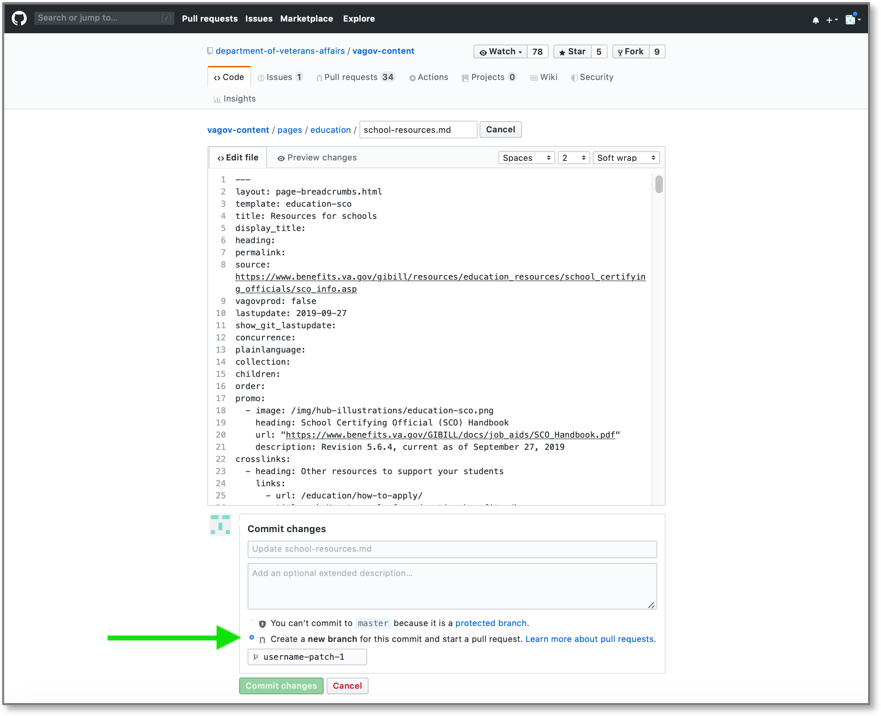  
*Figure 3: The school-administrators.md file with new branch option selected*  

4. In the branch name box above the green “Commit changes” button, use the auto-populated name, enter a custom name for the new development branch, or use an existing development branch, and then click the green “Commit Changes” to begin the process of initializing a draft pull request.  

  
*Figure 4: New branch name field and Commit changes button*  

The “Open a pull request” page appears.  If your changes are complete, skip to step 9 to create a real pull request.  Otherwise, continue to Step 5 to create a draft pull request.  

5. Add a description of the proposed changes (i.e., added new form) and add assignees if you’d like someone on the EDU team to review the edit.  

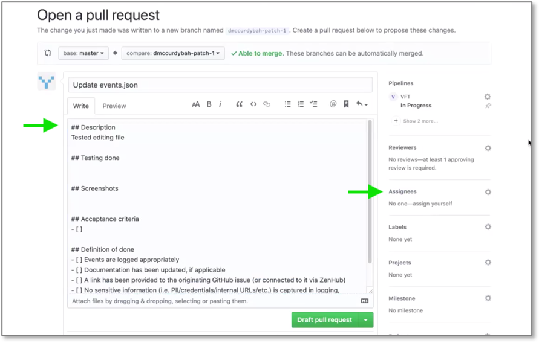   
*Figure 5: Enter description of changes*  

6. Be sure that the green button in the lower right corner of the page is set to “Draft pull request”.  

  
*Figure 6: Select "Draft Pull Request"*  

7. Click the “Draft pull request” button.  Submitting a draft pull request will create a preview content instance where you can review your changes. **The instance in ready in about 5 minutes.**  

  
*Figure 7: Review your submitted changes*   

8. How to return from preview instance

9. Repeat steps 1-7 as needed to refine the content. Once you are satisfied with the content, click the “Commit Changes” button, to create a real pull request.  The “Open a pull request” page will appear.  

  
*Figure 8: Open a pull request” page*  

10. Enter a description of the change you’ll be submitting for review and click the arrow to the right of the green “Create pull request” button in the lower right corner of the page to select “Create Pull Request” rather than “Draft Pull Request”. The pull request automatically flags the file for review by the review team.  
    **Note:** The review and approval process may take a day or so, so planning ahead will ensure that time-sensitive announcements appear on the site in a timely manner.    

  
*Figure 9: Select “Create Pull Request”*  

11. Address any recommendations suggested by reviewers.  

12. Once your edits have been reviewed and approved, you’ll receive an email from GitHub.  Click the link in the email to open the pull request, then click the “Merge” button which is now activated.  

    The page will be merged into the Master branch and deployed to the website during the daily deployment which starts at 2PM ET. Daily deployments are pushed to production and will be visible on the site shortly after 3PM ET.  

## Announcements

### What content appears in the "Latest announcements from VA" section?

The Announcements section of the "Resources for Students" page on VA.gov provides updates such as the publication of a new version of the School Certifying Official Handbook, the release of newly revised forms, and news related to legislation.  

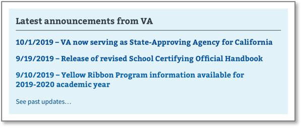  
*Figure 10: “Latest announcements from VA”*  

Each announcement, and its supporting content, will also be entered and displayed in the Announcements section of the Education landing page on benefits.va.gov. This is where users can see the full text of current and past announcements.  
 
**Note:** The “announcement” of events and webinars should be entered as events and will appear in the "Upcoming events" area.  
### How do I add an announcement?

To add a new announcement, follow the steps below:  

1. In GitHub, navigate to the announcements page.  

    **File name:** announcements.json  
    https://github.com/department-of-veterans-affairs/vets-website/blob/master/src/applications/static-pages/school-resources/constants/announcements.json  
    
    **Note:** If you are just starting the edit, make sure you have the “Master” branch selected in the upper left corner of the page.  If you are returning to finish editing a page you already started editing, be sure you have the correct branch selected in the upper left corner of the page.     

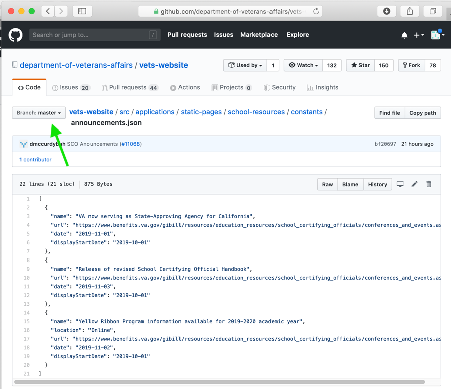  
*Figure 11: “The announcements.json file with Master branch selected”*  

2. Click the edit button in the upper right corner of the page to open the page for editing.  

  

  
*Figure 12: “Announcements.json” file with edit button highlighted*  

Each section of code between the curly brackets represents an announcement. Figure 12 above includes 3 announcements. The portions bolded below are editable. By copying, pasting and editing a block of code, you will be able to create a new announcement.  

>{  
"name": "**Yellow Ribbon Program information available for 2019-2020 academic year**",  
"location": "**Online**",  
"url": "**https://www.benefits.va.gov/gibill/resources/education_resources/school_certifying_officials/conferences_and_events.asp**",  
"date": "**2019-11-02**",  
"displayStartDate": "**2019-10-01**"  
"displayEndDate": "**2019-11-01**"  
}

3. Add a comma after the last “}” in the file to separate it from the new announcement you are about to add. You do not need to add a comma after the “}” at the end of all announcements. 

4. Copy one of the existing announcements, including all texts between the curly brackets { }, and paste it after the comma you just added at the end of the file. 

    **Note:** Deleting content after it’s expired will reduce clutter and make the page easier to maintain.

5. Edit the values that are highlighted in yellow. As you edit the information, follow the helpful hints below.  

    **name** (required)  
To ensure proper display, announcements should be capped at 120 characters. The date of the announcement is separate content element, so there is no need to include it in the name. 
 
    **url**  
    Include the full URL without spaces even if it is long and wraps to the next line.  
    Ex: "http://www...."
 
    **date** (required)  
Enter the date that will appear as the announcement’s publication date.  
Include dashes as separators and leading zeros, as necessary.  
Ex: 2019/12/04  

    **displayStartDate** (required)  
Enter the date the announcement should display on the site.  
Include dashes as separators and leading zeros, as necessary.  
Ex: 2010/12/05  
 
    **displayEndDate** (optional)  
Enter the date the announcement should expire. This is the last day the announcement will display on the site. If you choose not to enter a displayEndDate, the announcement will automatically expire 30 days after the displayStartDate.  This field is useful if you’d like an announcement to expire before or after 30 days.  
Include dashes as separators and leading zeros, as necessary.  
Ex: 2019/12/05   

  
*Figure 13: Example of an announcement*  

6. After you’ve made the necessary edits, scroll to the bottom of the page and confirm that the 2nd radio button (“Create a new branch for this commit and start a pull request”) is selected.  

  
*Figure 14: The create new branch option*  

7. In the branch name box above the green “Commit changes” button, use the auto-populated name, enter a custom name for the new development branch, or use an existing development branch, and then click the green “Commit Changes” to begin the process of initializing a draft pull request.  

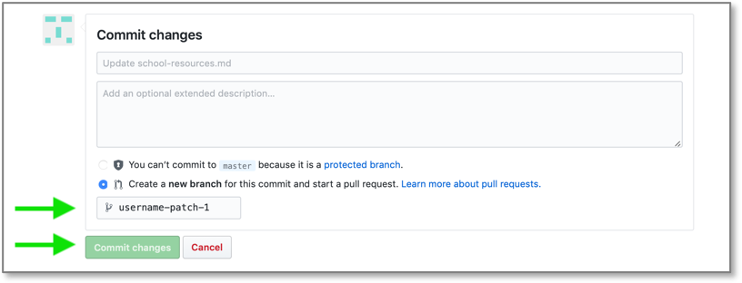  
*Figure 15: The new branch name field and Commit changes button*  

The “Open a pull request” page appears.  If your changes are complete, skip to step 11 to create a real pull request.  Otherwise, continue to Step 8 to create a draft pull request.  

8. Add a description of the proposed changes (i.e., added new form) and select assignees if you’d like someone on your team to review the edit.  

  
*Figure 16: Enter description of changes*  

9. Be sure the green button in the lower right corner of the page is set to “Draft pull request”.  

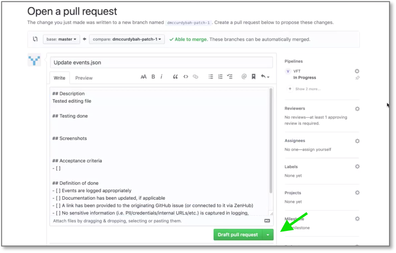  
*Figure 17: Select "Draft Pull Request"*  

10. Click the “Draft pull request” button.  Submitting a draft pull request will create a preview content instance where you can review your changes.  

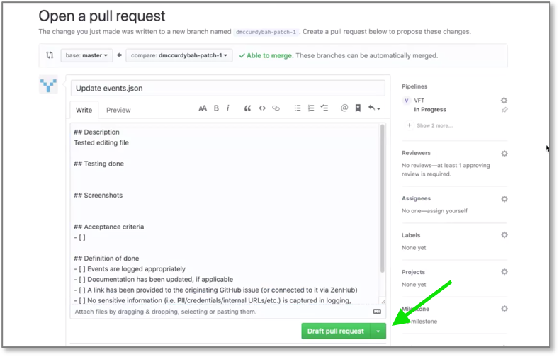  
*Figure 18: Click the "Draft Pull Request" button*  

11. Repeat steps 1-10 as needed to refine the content. Once you are satisfied with the content, click the “Commit Changes” button, to create a real pull request.  The “Open a pull request” page will appear.  

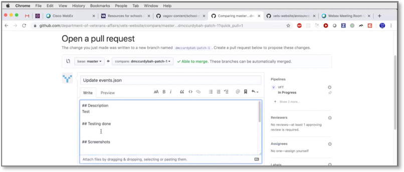  
*Figure 19: Open a pull request window appears*  

12. Enter a description of the change you’ll be submitting for review and click the arrow to the right of the green “Create pull request” button in the lower right corner of the page to select “Create Pull Request” rather than “Draft Pull Request”. The pull request automatically flags the file for review by the review team.  

     **Note:** The review and approval process may take a day or so, so planning ahead will ensure that time-sensitive announcements appear on the site in a timely manner. **Changes that have been approved by 2:00PM ET will likely be visible by 3:00PM ET.**

 
  
*Figure 20: Select “Create Pull Request”*  

13. Address any recommendations suggested by reviewers.  

14. Once your edits have been reviewed and approved, you’ll receive an email from GitHub.  Click the link in the email to open the pull request, then click the “Merge” button which is now activated.  

    The page will be merged into the Master branch and deployed to the website during the daily deployment which starts at 2PM ET. Daily deployments are pushed to production and will be visible on the site shortly after 3PM ET.   

### When do announcements expire?

* Announcements with no specified *displayEndDate* will automatically roll off the Resources for School page in 30 days.  
* Announcements with a *displayEndDate* will be displayed between their *displayStartDate* and *displayEndDate*. 
* After expiration, events will continue to display in the Information section of the Education landing page on benefits.va.gov page.  

## Events

### What content appears in the "Upcoming events" section?

The Upcoming Events section of the “Resources for schools” page promotes upcoming conferences, events, and training webinars that are applicable to SCOs and school administrators.   

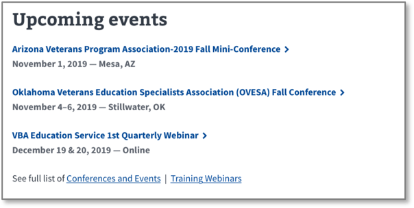   
*Figure 21: “Upcoming events” on the “Resources for schools” page*  

These events are also entered and displayed on the Events and Conferences, and Webinars pages on benefits.va.gov. 

### How do I add an event?

To add a new event to the Resources for Schools page, follow the steps below:  

1. In GitHub, navigate to the events page.  

    **File Name:** “events.json”  
    https://github.com/department-of-veterans-affairs/vets-website/blob/master/src/applications/static-pages/school-resources/constants/events.json

    **Note:** If you are just starting the edit, make sure you have the “Master” branch selected in the upper left corner of the page.  If you are returning to finish editing a page you already started editing, be sure you have the correct branch selected in the upper left corner of the page.  
    
   
*Figure 22: ““Events.json” file with Master branch selected*  

2. Click the edit button in the upper right corner of the page to open the page for editing.  

  

   
*Figure 23: “Events.json” file with Edit button highlighted*   

Each section of code between the curly brackets represents an event.  Figure 23 above includes 4 events. The portions that are highlighted in yellow below are editable.  By copying, pasting and editing a block of code, you will be able to create a new event.
    
>{    
  "name": "**Arizona Veterans Program Association-2010 Fall Mini-Conference**",  
  "location": "**Mesa, AZ**",
"url":"**https://www.benefits.va.gov/gibill/resources/education_resources/school_certifying_officials/conferences_and_events.asp**",  
  "displayStartDate": "**2010-11-01**",  
  "eventStartDate": "**2010-11-01**",  
  "eventEndDate": "**2010-11-02**"  
},
    
3. Add a comma after the last curly bracket “}” in the file, so you can separate previous events from the new event you are about to add.  

    **Note:** After the last event there should be no comma.  
    
4. Copy one of the existing events, including all text between the curly brackets { }, and paste it after the comma you just added at the end of the file. 

    **Note:** Deleting content after it’s expired will reduce clutter and make the page easier to maintain.  
    
5. Edit the values that are highlighted in yellow. As you edit the information, follow the helpful hints below.  

    **name** (required)   
To ensure proper display, the event name should be 156 characters or less.
 
    **url** (required)  
Ensure that there are no spaces in the URL. 
 
    **location** (required)  
For physical events, enter the "City" and "State abbreviation" separated with a comma.  
For webinars, enter "Online".
 
    **eventStartDate** (required)  
Enter the start date of the event.  
Include dashes as separators and leading zeros, as necessary.  
Ex: 2010/12/05

    **eventEndDate** (optional)
Enter the last date of the event. An end date is only needed for events that span multiple days.   
Include dashes as separators and leading zeros, as necessary.
Ex: 2010/12/05

    **displayStartDate** (required)
Enter the date that you would like the event to display on the site.  
Include dashes as separators and leading zeros, as necessary.  
The event will automatically expire on the day after the event.  
Ex: 2010/12/05

**Example of a physical event**

   
*Figure 24: Example of a physical event* 

**Example of an online webinar**

   
*Figure 245 “Example of an online webinar*  

6. After you’ve made the necessary edits, scroll to the bottom of the page and confirm that the 2nd radio button (“Create a new branch for this commit and start a pull request”) is selected.  

   
*Figure 26: The Create new branch option selected* 

7. In the branch name box above the green “Commit changes” button, use the auto-populated name, enter a custom name for the new development branch, or use an existing development branch, and then click the green “Commit Changes” to begin the process of initializing a draft pull request.

   
*Figure 27: The branch name field and Commit changes button highlighted*  

The “Open a pull request” page appears.  If your changes are complete, skip to step 11 to create a real pull request.  Otherwise, continue to Step 8 to create a draft pull request.  

8. Add a description of the proposed changes (i.e., added new form) and select assignees if you’d like someone on the EDU team to review the edit.  

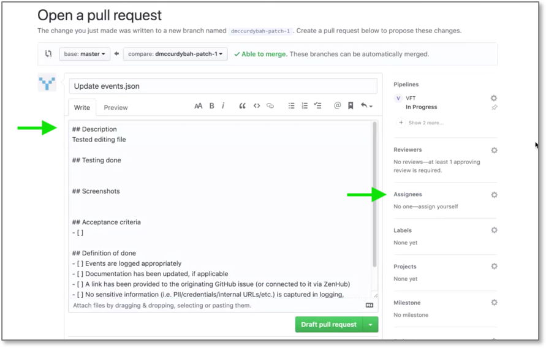   
*Figure 28: Enter description of changes*  

9. Be sure “Draft pull request” selected as the green button name in the lower right corner of the page.  

   
*Figure 29: Select "Draft Pull Request"* 

10. Click the “Draft pull request” button.  Submitting a draft pull request will create a preview content instance where you can review your changes.  

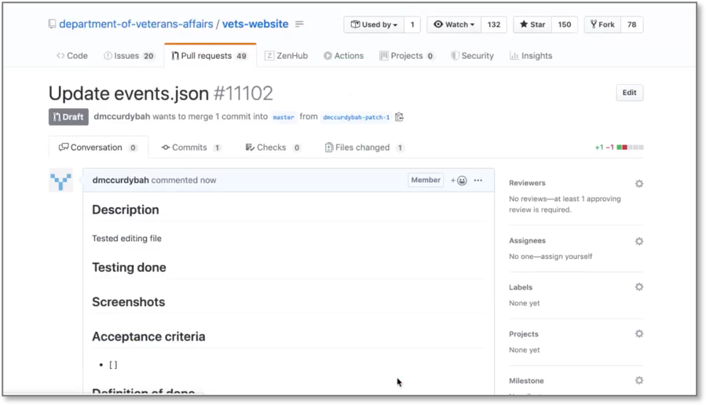   
*Figure 30: Click the “Draft pull request” button* 

11. Repeat steps 1-10 as needed to refine the content. Once you are satisfied with the content, click the “Commit Changes” button, to create a real pull request.  The “Open a pull request” page will appear.  

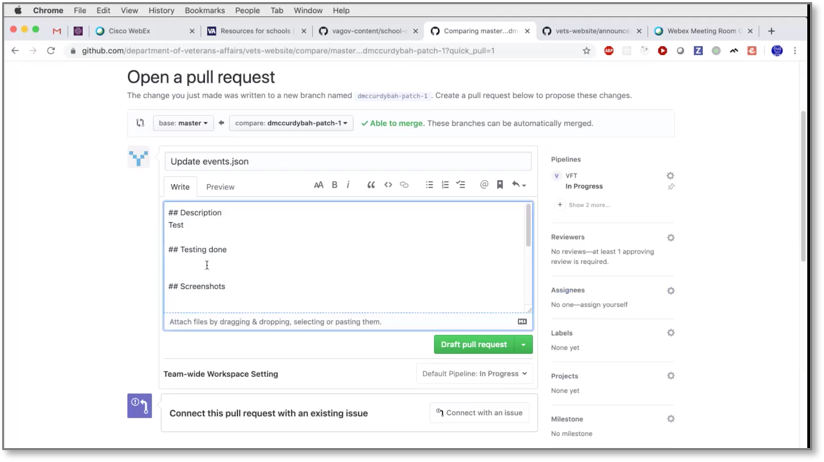   
*Figure 31: "Open a pull request" page*  

12. Enter a description of the change you’ll be submitting for review and click the arrow to the right of the green “Create pull request” button in the lower right corner of the page to select “Create Pull Request” rather “Draft Pull Request”. The pull request automatically flags the file for review by the review team.  

     **Note:** The review and approval process may take a day or so, so planning ahead will ensure that time sensitive announcements appear on the site in a timely manner. **Changes that have been approved by 2:00PM ET will likely be visible by 3:00PM ET.** 
    
   
*Figure 32: Select “Create Pull Request”*   

13. Address any recommendations suggested by reviewers.  

14. Once your edits have been reviewed and approved, you’ll receive an email from GitHub.  Click the link in the email to open the pull request, then click the “Merge” button which is now activated.    
 
    The page will be merged into the Master branch and deployed to the website during the daily deployment which starts at 2PM ET. Daily deployments are pushed to production and will be visible on the site shortly after 3PM ET.  
    
### When do events expire?

* Events expire and are removed from the “Resources for Schools” page one day after the **eventEndDate**.  
* If an **eventEndDate** is not entered, the system assumes the event lasts one day and automatically makes the **eventEndDate** the same as the **eventStartDate**. 
* If an event is postponed or cancelled, the event can be modified or removed from the events.json file.  

## Pulll request review process

### How do I address reviewer comments?  

After you submit a pull request, you may receive change requests from the reviewers.  Follow the steps below to resolve any issues that need to be addressed and resubmit the pull request.

1. Open the notification you received and click the link to access the Update page.  The Update page appears. By default, the “Conversation” tab will be displayed.  

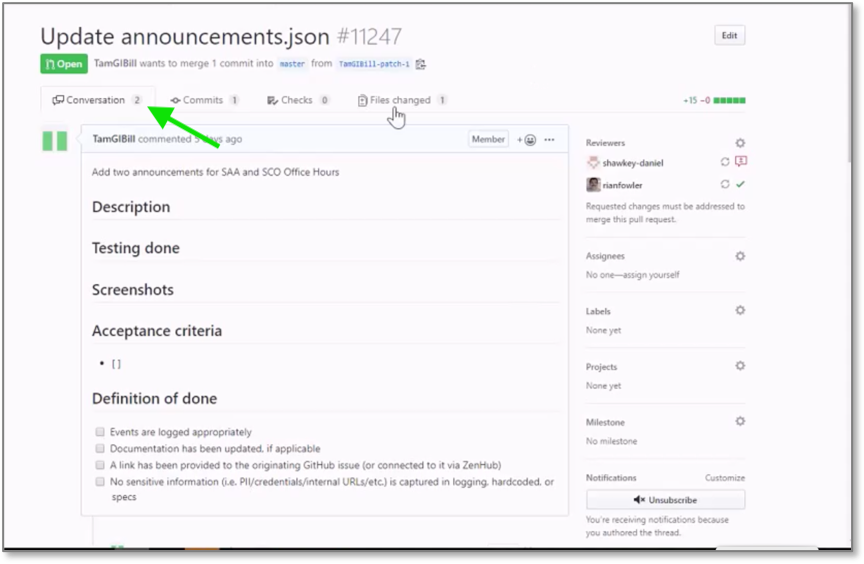   
*Figure 33: The “Update” page with the “Conversation” tab displayed by default*  

2. Click the “Files Changed” tab near the top of the page to see the reviewer’s comments.  

   
*Figure 34: “Files Changed” tab on the Update page*  

3. Read each of the reviewer’s comments. If clarification is needed, or you wish to discuss any of the issues, you can enter a reply.  

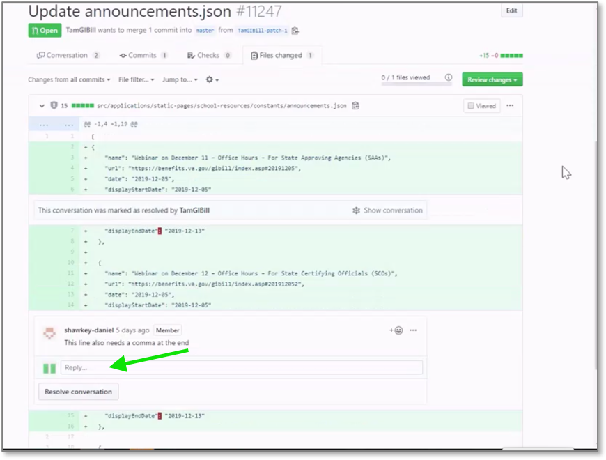   
*Figure 35: Enter a reply*

4. When you are ready to make the edits, click the 3 dots (…) in the upper right corner of the page to the right of the “Viewed” button, and then select the “Edit File” option.  The file will open.  

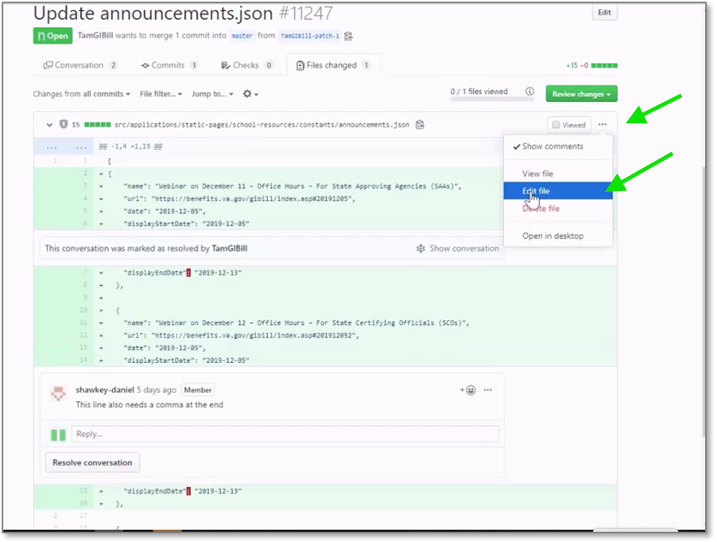   
*Figure 36: Open the file for editing*  

**Note:** As you make the edits, you may wish to go back to re-review the issues.  You can add any necessary remarks and click the “Resolve Conversation” buttons associated with each comment, as needed.  

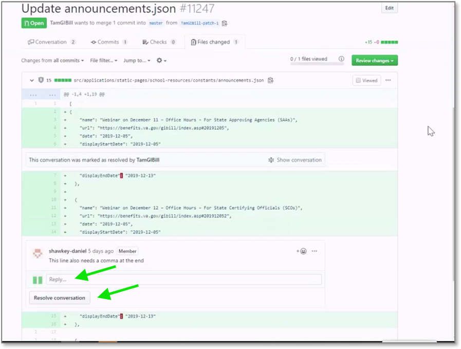   
*Figure 37: Enter reply and click “Resolve conversation”*  

5. Once you’ve finished making the edits, click the green “Commit changes” button at the bottom of the “Files Changed” tab to re-submit the pull request to the reviewers.  

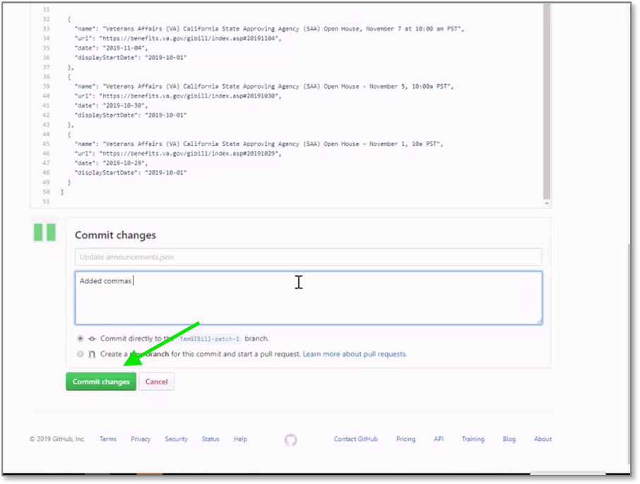   
*Figure 38: Make edits and “Commit Changes”*    

6. The reviewers will receive an email letting them know that a change has been made. The reviewers will open the email and approve the change. The file is now ready to be deployed to the live site.  

## Useful resources

The following guides may be useful for creating content in the VA.gov style.

* **Resources for Schools Page Content Strategy Guide**  
https://github.com/department-of-veterans-affairs/va.gov-team/blob/master/products/office-administration/vba/sco-migration/design/content/content-strategy.md   
Provides background information on the components that appear on the Resources for Schools page.

* **Content writing and plain language best practices**  
https://github.com/department-of-veterans-affairs/va.gov-team/blob/master/platform/content/content-best-practices.md   Provides links to the content styleguide and design styleguide.
 
* **VA.gov content style guide**  
https://design.va.gov/content-style-guide/  
Helps to ensure that all content on VA.gov is written in the same voice.

* **VA.gov design system style guide**  
https://design.va.gov/documentation/  
Provides design guidelines and code to help you quickly create trustworthy, accessible, and consistent digital services

* **VA.gov GitHub content process**  
https://github.com/department-of-veterans-affairs/va.gov-team/blob/master/platform/content/GitHub_content_process.pdf)   Explains how to edit content on GitHub.

* **VA.gov PR process and code review guidelines**   
https://github.com/department-of-veterans-affairs/va.gov-team/blob/a33e322c34798b6bbd863eeceb888c0420114c2c/platform/engineering/code_review_guidelines.md  
Provides additional guidance on the PR process and code review process.

